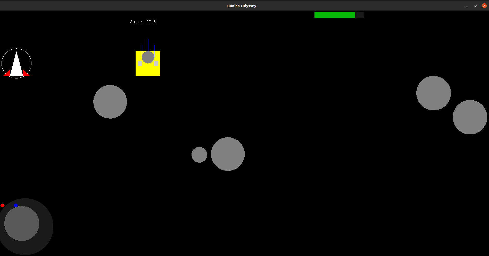

# lumina_odyssey
### Computer Graphics Assignment
Implemented using OpenGL and GLUT (OpenGL Utility Toolkit). It involves controlling a spaceship to avoid asteroids, collect power-ups, and reach the space station to win the game. 

#### Prerequisites
Have GLUT on your system. For debian based linux systems:
```
sudo apt-get update
sudo apt-get install freeglut3-dev
```

#### To compile:
```
cd lumina_odyssey\src
```
```
g++ main.cpp -lglut -lGLU -lGL
```

#### Execute:
```
./a.out
```

#### Controls

- **Movement:** Arrow keys (↑, ↓, ←, →)
- **Restart:** Press F1 to restart the game




### Methods
1. **initAsteroids(int numAsteroids)**

    - **Functionality:** Initializes asteroids for the game.
    - **Parameters:** numAsteroids - Number of asteroids to be initialized.
    - **Details:** Randomly generates asteroids with varying sizes and speeds within the game window.

2. **checkCollision(float x1, float y1, float size1, float x2, float y2, float size2)**

    - **Functionality:** Checks collision between two objects.
    - **Parameters:** x1, y1, size1 - Position and size of the first object. x2, y2, size2 - Position and size of the second object.
    - **Details:** Utilized primarily to check collision between objects of different types (e.g., spaceship and asteroids).

3. **checkAsteroidCollision()**

    - **Functionality:** Handles collision between asteroids.
    - **Details:** Iterates through the vector of asteroids and checks for collisions between any two asteroids, adjusting their velocities accordingly.

4. **spawnPowerUp()**

    - **Functionality:** Spawns a power-up.
    - **Details:** Randomly spawns a power-up within the game window, updating its position and spawn time.

5. **handlePowerUp()**

    - **Functionality:** Handles power-up effects and durations.
    - **Details:** Manages the effects of power-ups (e.g., health boost, immunity) and their durations.

6. **resetGameForNextLevel()**

    - **Functionality:** Resets game parameters for the next level.
    - **Details:** Resets ship position, asteroid count, and other game parameters in preparation for the next level.

7. **checkLevelTransition()**

    - **Functionality:** Manages level transitions.
    - **Details:** Controls level transitions based on elapsed time or specific conditions (e.g., reaching the space station).

8. **renderHealthBar()**

    - **Functionality:** Renders the health bar.
    - **Details:** Draws the health bar on the screen to visualize the player's health status.

9. **renderMiniMap()**

    - **Functionality:** Renders the mini-map.
    - **Details:** Displays a mini-map showing the spaceship's position and, if applicable, the space station's position.
    

10. **keyboard(int key, int x, int y)**

    - **Functionality:** Handles keyboard input.
    - **Details:** Processes keyboard input for controlling the spaceship and initiating game restart.

11. **display()**

    - **Functionality:** Displays the game screen.
    - **Details:** Main function responsible for rendering game elements, updating their positions, checking collisions, and managing game states.

12. **main(int argc, char** argv)**

    - **Functionality:** Main function.
    - **Details:** Initializes GLUT, sets up the game window, sets event callbacks, and enters the main event processing loop.
